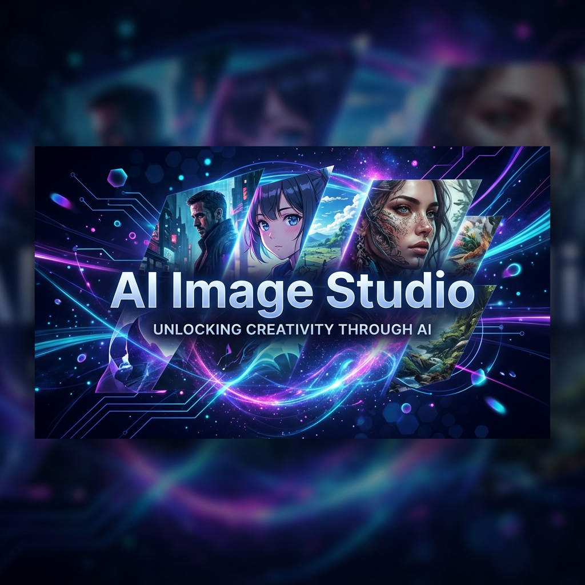

<div align="center">
  
  
  # GPT Image 2 API – Unofficial SDK & Usage Guide
  
  [](https://opensource.org/licenses/MIT)
  []()
  []()
  
  🚀 **The fastest way to use GPT Image 2 for AI image generation, editing, and style transfer.**
</div>

---

## 🌟 Overview

**GPT Image 2** is a next-generation AI image model designed for high-fidelity visual creation. This SDK provides a streamlined interface for developers to integrate powerful image generation and transformation capabilities into their applications.

> [!TIP]
> **New to the platform?** Check out our [How to Use GPT Image 2](./docs/how-to-use-gpt-image-2.md) tutorial or see how we stack up in the [GPT Image 2 vs Nano Banana 2](./gpt-image-2-vs-nano-banana-2.md) comparison.

> Generate high-quality images using prompts, convert images to Ghibli-style, and access professional-grade AI image processing.

---

## 🔥 Key Features

- **🧠 Intelligent Prompting:** Advanced Text-to-Image generation using GPT-driven understandings.
- **🖼️ Style Transfer:** Transform existing images into Ghibli-style, Pixar-style, or cinematic masterpieces.
- **⚡ High Performance:** Optimized API endpoints for low-latency responses.
- **🎨 Multi-Style Support:** Seamlessly switch between realistic, anime, and artistic styles.
- **🔗 Ecosystem Compatible:** Fully compatible with OpenAI-standard image generation patterns.

---

## 📊 Model Comparison

| Feature | GPT Image 2 | Nano Banana 2 | DALL·E 3 |
| :--- | :---: | :---: | :---: |
| **Output Quality** | ⭐⭐⭐⭐⭐ | ⭐⭐⭐ | ⭐⭐⭐⭐ |
| **Generation Speed** | ⭐⭐⭐⭐ | ⭐⭐⭐⭐⭐ | ⭐⭐⭐ |
| **Style Flexibility** | High (Realistic) | Medium (Stylized) | Balanced |
| **API Latency** | < 2s | < 1s | ~5s |

---

## 🛠️ Getting Started

### 1. Installation

Clone the repository and install the necessary dependencies:

```bash
git clone https://github.com/yourname/gpt-image-2-api.git
cd gpt-image-2-api
pip install -r requirements.txt
```

### 2. Quick Start Example (Python)

```python
import requests

# API Endpoint Configuration
url = "https://api.example.com/v1/gpt-image-2"
headers = {
    "Authorization": "Bearer YOUR_API_KEY",
    "Content-Type": "application/json"
}

# Generation Payload
payload = {
    "prompt": "a cinematic candy cane world, ultra realistic, 8k, detailed textures",
    "size": "1024x1024",
    "style": "cinematic"
}

# Execute Request
response = requests.post(url, json=payload, headers=headers)
data = response.json()

print(f"Generated Image URL: {data.get('url')}")
```

---

## 🎨 Example Prompts

Try these prompts to see the power of GPT Image 2:

- `convert image to ghibli-style` - *Best for scenic transformations.*
- `ultra realistic portrait, 85mm lens, cinematic lighting, 8k` - *Best for photography.*
- `christmas candy cane aesthetic, glossy texture, macro shot` - *Best for product design.*

---

## 🔌 API Reference

| Endpoint | Method | Description |
| :--- | :---: | :--- |
| `/v1/generate` | `POST` | Create a new image from a text prompt. |
| `/v1/edit` | `POST` | Modify an existing image based on instructions. |
| `/v1/style-transfer`| `POST` | Apply a specific artistic style to an image. |

---

## ❓ Frequently Asked Questions

**Q: How do I access the GPT Image 2 API?**
A: You can access it via our official endpoints or through verified third-party integrations listed in our documentation.

**Q: Is GPT Image 2 free to use?**
A: Usage varies by provider. Our base SDK is free, but API calls may incur costs depending on your tier.

**Q: What is the maximum resolution supported?**
A: Currently, we support up to **2048x2048** for premium users.

---

## 🔍 SEO & Metadata

- **Keywords:** `gpt image 2 api`, `how to use gpt image 2`, `openai image 2`, `chatgpt image generator`, `ai image generator`, `gpt image 2 vs nano banana 2`
- **Application Category:** AI Development Tools / Image Generation

---

## ⚠️ Disclaimer

This is an **unofficial** project for research and educational purposes. All trademarks belong to their respective owners. Read our [Terms of Service]() for more details.
